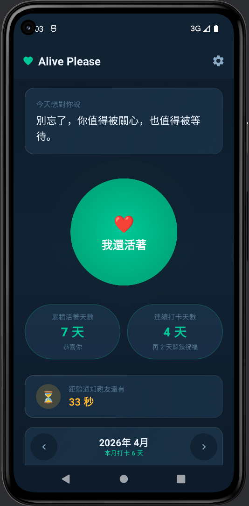

# Alive Please

Alive Please 是一個以 Android 製作的報平安 App。

它的核心目的很簡單：
讓使用者每天按一下「我還活著」完成打卡，並在太久沒有報平安時，自動通知指定的親友。

## 功能

- 每日報平安打卡
- 連續打卡天數與累積天數顯示
- 每 3 天一次的鼓勵祝福提示
- 可自訂打卡提醒間隔
- 可設定親友 Email 與稱呼
- 支援 GAS Webhook 寄信
- 太久未打卡時自動通知親友
- 支援開機後重新恢復提醒與通知排程
- 內建設定導覽與測試寄信流程

## 畫面展示

```md
## Screenshots

| Home | Settings | Onboarding |
|---|---|---|
|  |  |  |
```
